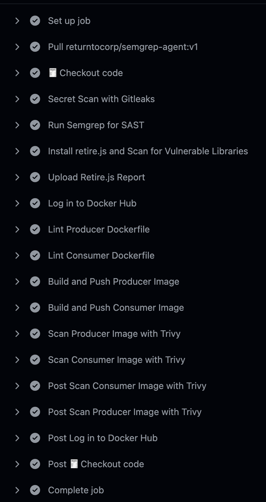

# ⚡ SmartGridFlow: A Cloud-Native Real-Time Smart-Meter Data Pipeline

**SmartGridFlow** is a cloud-native, real-time data pipeline that simulates and processes energy-usage data from smart meters — mirroring production-grade systems used by energy and infrastructure providers. It showcases real-time streaming with **Kafka**, Python-based processing, and persistent storage in **PostgreSQL**, all orchestrated via **Kubernetes** and **Terraform**, with GitOps managed through **ArgoCD**.

---

## 📐 Architecture Diagram

```
[ Smart Meter Simulator Pod ]
            |
 Kafka Topic: smart-meter-data
            |
   [ Kafka Consumer Pod ]
            |
     PostgreSQL Database
```

---

## 🚀 Tech Stack

- **Python** – Simulator and consumer applications  
- **Apache Kafka** – Real-time streaming platform  
- **PostgreSQL** – Persistent storage for smart-meter readings  
- **Docker** – Containerisation of all services  
- **Kubernetes (Kind)** – Local Kubernetes cluster for development  
- **Terraform** – Infrastructure-as-Code (deployed via Helm)  
- **Helm** – Simplified deployment of Kafka, PostgreSQL, and ArgoCD  
- **ArgoCD** – GitOps controller for automatic deployment syncing  
- **Makefile** – End-to-end automation of the pipeline  
- **GitHub Actions** – CI/CD with integrated security scans

---

## 📁 Folder Structure

```
smartgridflow/
├── simulator/          # Smart-meter producer app
├── consumer/           # Kafka consumer app
├── terraform/          # Infrastructure provisioning (Kafka, Postgres, ArgoCD)
├── k8s/                # Kubernetes manifests
│   ├── producer/
│   ├── consumer/
│   └── argocd/         # ArgoCD Application YAML
├── helm_values/        # Custom Helm values files
├── kind-config.yaml    # Kind cluster configuration
├── Makefile            # Automation commands
├── screenshots/        # Visual evidence of the project running
└── README.md           # Project documentation
```

---

## ⚙️ How It Works

1. **Simulator** generates synthetic smart-meter readings and publishes them to the Kafka topic `smart-meter-data`.  
2. **Kafka** buffers these messages in real time.  
3. **Consumer** subscribes to the topic and stores the messages in **PostgreSQL**.  
4. **PostgreSQL** stores this data for downstream analytics or visualisation.  
5. All services are containerised and deployed in **Kubernetes**, provisioned by **Terraform** and managed using **GitOps via ArgoCD**.  

---

## 🔧 Prerequisites

Ensure the following tools are installed locally:

- Docker  
- Terraform  
- Kind (Kubernetes-in-Docker)  
- Python 3.10+  
- Make  
- kubectl  

---

## 🚀 Run Everything

```bash
make all
```

This will:

1. Provision the Kind cluster using Terraform  
2. Deploy Kafka, PostgreSQL, and ArgoCD via Helm  
3. Apply the ArgoCD Application which watches your GitHub repo  
4. Perform a one-time deployment of the simulator and consumer apps  
5. Run a full test to confirm data is flowing into PostgreSQL  

---

## 🧪 Makefile Commands

| Command           | Description                                                           |
|------------------|-----------------------------------------------------------------------|
| `make all`       | Full end-to-end setup and test                                        |
| `make apply`     | Run Terraform to provision infrastructure                             |
| `make argocd`    | Display ArgoCD access link and password                               |
| `make argocd-app`| Apply the ArgoCD application definition                               |
| `make deploy`    | One-time apply of app manifests (bootstrap ArgoCD sync)               |
| `make test`      | Stream logs and verify PostgreSQL ingestion                           |
| `make destroy`   | Teardown: destroy infra and delete Kind cluster                       |

---

## 🔁 Continuous Integration & DevSecOps

This project uses a **GitHub Actions pipeline** to build and secure Docker images for the simulator and consumer apps.

### 🔧 CI/CD Pipeline Highlights

| Stage                     | Tool/Action                                |
|--------------------------|--------------------------------------------|
| ✅ Code checkout          | `actions/checkout`                         |
| 🔐 Secret scanning        | `Gitleaks`                                 |
| 🛡️ Static analysis        | `Semgrep`                                  |
| 📦 Dependency scan        | `Retire.js` for JavaScript libs            |
| 🧪 Dockerfile linting     | `Hadolint`                                 |
| 🏗️ Build & push images    | Docker build + push to Docker Hub         |
| 🔍 Image vulnerability scan | `Trivy` (CRITICAL + HIGH severity only)   |

> ✅ The pipeline is triggered manually (`workflow_dispatch`) and can be extended to run on pull requests or commits to `main`.

---

## 📷 Visual Project Evidence

### ✅ GitHub Actions CI/CD Pipeline

  
<sub>🔍 GitHub Actions running complete DevSecOps checks before pushing images to Docker Hub</sub>

---

### 📊 ArgoCD GitOps Sync

  
<sub>🌍 ArgoCD confirms the sync status and app health, enabling true GitOps</sub>

---

### 📦 Full System Output Verification

  
<sub>🧪 Real-time logs from simulator and consumer; PostgreSQL confirms successful ingestion</sub>

---

## 📊 ArgoCD Access

After running `make argocd`, you'll get:

- ✅ ArgoCD login password
- 🔗 Port-forwarding command to access ArgoCD UI
- 💻 URL: `https://localhost:8080`
- 📌 GitOps kicks in after initial deployment

---

## 🔍 Testing the Pipeline

```bash
make test
```

This command:

- Waits for services to be ready  
- Streams logs from producer and consumer  
- Queries PostgreSQL to confirm real-time ingestion  

---

## 🧼 Cleaning Up

```bash
make destroy
```

Cleans your entire environment by:

- Destroying Terraform-managed infra  
- Removing the local Kind cluster  

---

## 📄 License

Distributed under the **MIT License** — feel free to fork, adapt, and contribute.

---

## 🤝 Contributing

Contributions are welcome! Add new features like Prometheus/Grafana monitoring, external DNS, sealed secrets, or CI/CD integrations. Feel free to open issues or submit PRs.
