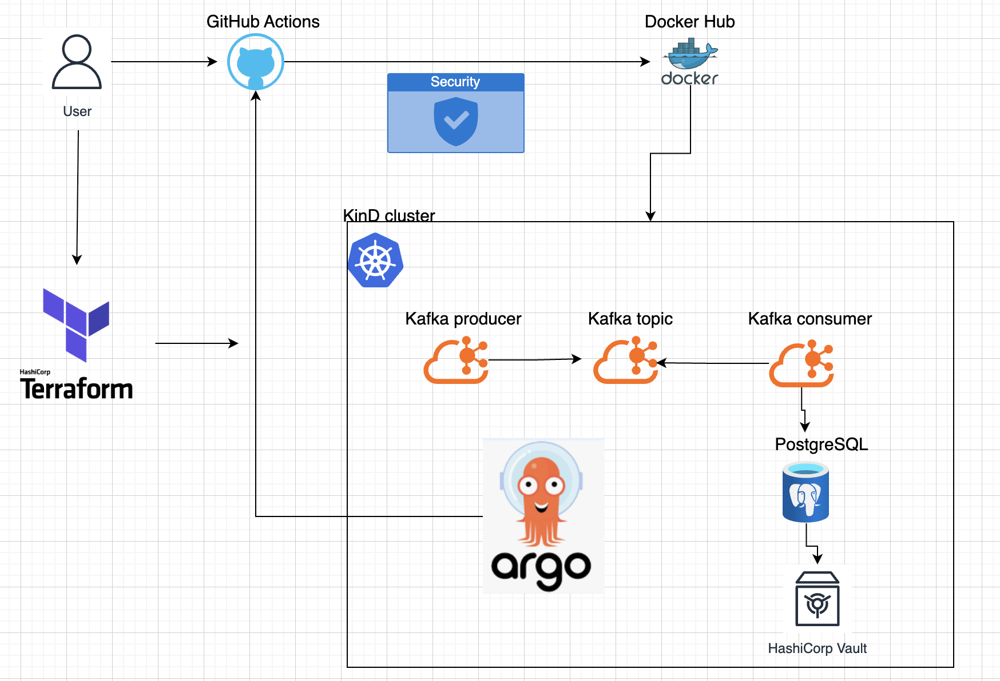
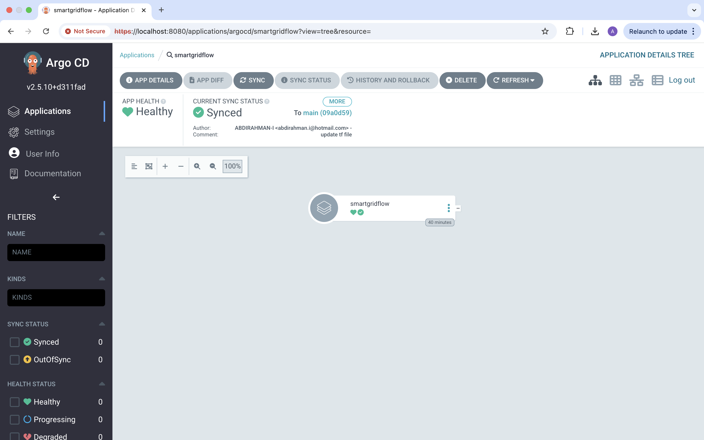
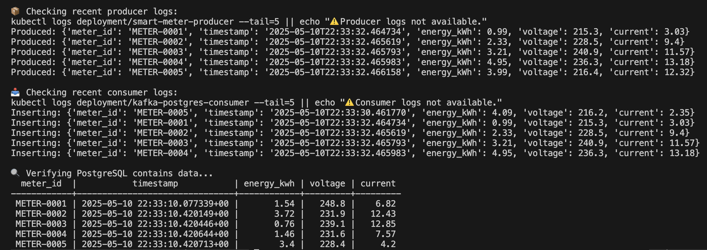

# ⚡ SmartGridFlow: A Cloud-Native Real-Time Smart-Meter Data Pipeline

**SmartGridFlow** is a production-inspired, cloud-native, real-time data pipeline that simulates and processes energy usage from smart meters. It leverages streaming with **Kafka**, processing in **Python**, secure storage in **PostgreSQL**, and a fully automated GitOps + DevSecOps pipeline using **Terraform**, **Helm**, **ArgoCD**, and **Vault**.

---

## 📐 Architecture Diagram

  

---

## 🚀 Tech Stack

- **Python** – Producer & Consumer microservices  
- **Apache Kafka** – Real-time message broker  
- **PostgreSQL** – Structured data storage  
- **Docker** – Containerisation  
- **Kubernetes (Kind)** – Local cluster for development/testing  
- **Terraform** – Infrastructure provisioning  
- **Helm** – Chart-based deployment  
- **ArgoCD** – GitOps controller for declarative K8s syncing  
- **HashiCorp Vault** – Secure secrets management  
- **GitHub Actions** – CI/CD with DevSecOps integrations  
- **Makefile** – Automation of all steps  

---

## 📁 Folder Structure

```
smartgridflow/
├── simulator/          # Smart-meter producer app
├── consumer/           # Kafka consumer app
├── terraform/          # Terraform configs (infra, ArgoCD, Vault)
├── k8s/                # Kubernetes manifests (producer, consumer, ArgoCD app)
├── helm_values/        # Custom Helm values
├── Makefile            # All-in-one project automation
├── kind-config.yaml    # Kind cluster config
├── images/             # Visual evidence/screenshots
└── README.md           # This file
```

---

## ⚙️ How It Works

1. **Simulator** generates real-time smart-meter readings and pushes them to a Kafka topic.
2. **Kafka** buffers and streams data to subscribed consumers.
3. **Consumer** reads from Kafka and writes to PostgreSQL.
4. **PostgreSQL** holds data for analytics or reporting.
5. **Vault** securely stores PostgreSQL credentials, avoiding hardcoding.
6. **ArgoCD** monitors the repo and auto-applies any Kubernetes changes (GitOps).
7. **Makefile** wraps all deployment/testing/teardown commands.

---

## 🔐 Secrets Management with Vault

To avoid storing passwords in YAML or code, we use **HashiCorp Vault** (via Helm + Terraform).

### ✅ How it's set up:

- Vault is deployed with Terraform using Helm in dev mode
- PostgreSQL creds (`smartuser`/`smartpass`) are stored in Vault at `secret/postgres`
- Consumer app can retrieve these dynamically via Vault CLI or HTTP API

### 📥 Store secret in Vault

```bash
vault kv put secret/postgres smartuser=smartuser smartpass=smartpass
```

### 📤 Retrieve secret in Vault Pod

```bash
kubectl exec -it vault-0 -n vault -- /bin/sh
export VAULT_ADDR='http://127.0.0.1:8200'
vault kv get secret/postgres
```

🔒 This allows secure, dynamic credential management in a cloud-native environment.

---

## 🔧 Prerequisites

Install locally:

- Docker  
- Terraform  
- Kind  
- Python 3.10+  
- kubectl  
- Helm  
- Vault CLI  
- Make

---

## 🚀 Run Everything

```bash
make all
```

1. Creates Kind cluster  
2. Deploys Kafka, PostgreSQL, Vault, and ArgoCD via Terraform + Helm  
3. Pushes simulator & consumer deployments  
4. Verifies ingestion to PostgreSQL  

---

## 🧪 Makefile Commands

| Command           | Description                                                           |
|------------------|-----------------------------------------------------------------------|
| `make all`       | Full end-to-end deployment & test                                     |
| `make apply`     | Terraform provisioning                                                |
| `make deploy`    | Deploy apps manually to K8s                                            |
| `make argocd`    | Shows ArgoCD password and port-forward info                           |
| `make test`      | Verifies logs and database ingestion                                  |
| `make destroy`   | Full teardown (Terraform + Kind)                                      |

---

## 🔁 CI/CD & DevSecOps

### ✅ GitHub Actions Pipeline Includes:

| Stage                       | Tool               |
|----------------------------|--------------------|
| Source Control             | GitHub             |
| Secret Scanning            | Gitleaks           |
| Static Code Analysis       | Semgrep            |
| Dependency Scanning        | Retire.js          |
| Dockerfile Linting         | Hadolint           |
| Build & Push Docker Images | Docker             |
| Vulnerability Scans        | Trivy              |

📦 Docker images are pushed to Docker Hub and pulled by Kubernetes deployments.

---

## 📷 Visual Proof

### 🔄 ArgoCD GitOps Dashboard

  
<sub>🌀 Real-time syncing from GitHub → Kubernetes</sub>

---

### 🐘 PostgreSQL Data Verification

  
<sub>🧪 Pipeline logs + successful database ingestion</sub>

---

## 🌍 ArgoCD Access

```bash
make argocd
```

- Shows ArgoCD password
- Port-forwards web UI to `https://localhost:8080`
- GitOps monitoring auto-kicks in after setup

---

## 🧪 Testing the Pipeline

```bash
make test
```

- Tails pod logs  
- Queries PostgreSQL for latest readings  
- Validates end-to-end ingestion  

---

## 🧼 Tear Down

```bash
make destroy
```

- Removes infrastructure (Terraform destroy)
- Deletes local cluster (Kind delete)

---

## 📄 License

MIT – Free to use, adapt, and contribute.

---

## 🤝 Contributions Welcome

Ideas? Bugs? Additions (Prometheus, metrics, dashboards)?  
PRs and Issues are welcome.

---
